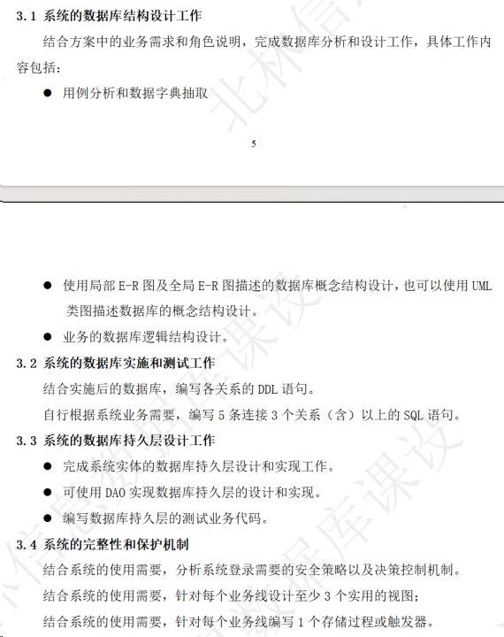

# 数据库课设后续工作

## 目录

-   [后续工作安排](#后续工作安排)
    -   [任务](#任务)
        -   [系统登录需要的安全策略以及决策控制机制](#系统登录需要的安全策略以及决策控制机制)
        -   [每个业务线设计至少 3 个实用的视图](#每个业务线设计至少-3-个实用的视图)
            -   [列出数据库中所有创建的视图](#列出数据库中所有创建的视图)
            -   [查看某个具体视图的定义](#查看某个具体视图的定义)
            -   [创建视图](#创建视图)
            -   [查看视图内容](#查看视图内容)
            -   [视图的访问权限](#视图的访问权限)
            -   [检查当前的角色信息](#检查当前的角色信息)
        -   [针对每个业务线编写 1 个存储过程或触发器](#针对每个业务线编写-1-个存储过程或触发器)
            -   [存储过程的作用](#存储过程的作用)
                -   [1. 模块化和代码重用](#1-模块化和代码重用)
                -   [2. 性能优化](#2-性能优化)
                -   [3. 安全性](#3-安全性)
                -   [4. 维护](#4-维护)
            -   [创建存储过程](#创建存储过程)
            -   [授予管理员角色权限](#授予管理员角色权限)
            -   [使用存储过程](#使用存储过程)
        -   [触发器](#触发器)
            -   [创建一个存储变更记录的表](#创建一个存储变更记录的表)
            -   [创建触发器](#创建触发器)
            -   [测试触发器](#测试触发器)
    -   [索引](#索引)
        -   [检查现有的索引](#检查现有的索引)
        -   [创建索引](#创建索引)
    -   [答辩](#答辩)
        -   [1.答辩ppt制作](#1答辩ppt制作)
        -   [2.列出团队成员的交流和对项目的贡献情况](#2列出团队成员的交流和对项目的贡献情况)
        -   [3.关于整个项目的演示](#3关于整个项目的演示)
        -   [4.关于课设报告](#4关于课设报告)
-   [目前存在问题](#目前存在问题)
    -   [1.关于创建角色、创建时间等问题](#1关于创建角色创建时间等问题)
    -   [2.关于病名的外键问题](#2关于病名的外键问题)
    -   [3.关于种的分布区域的问题](#3关于种的分布区域的问题)
    -   [4.关于监测指标的问题](#4关于监测指标的问题)

# 后续工作安排


## 任务

### **系统登录需要的安全策略以及决策控制机制**

**用户和角色管理**：在 SQL Server 中，可以创建不同的数据库用户和角色，并为它们分配不同的权限。例如，您可以为管理员、养护人员、监测人员等创建不同的角色，并根据他们的工作职责分配相应的数据库访问权限。

**对象级安全**：可以为特定的表、视图、存储过程等设置权限，确保只有拥有相应权限的用户才能访问或修改这些对象。

**加密**：对敏感数据（如联系信息）进行加密，保护数据免受未授权访问。

```sql
--创建登录过程
CREATE LOGIN AdminLogin WITH PASSWORD = '123456';
CREATE LOGIN MaintenanceLogin WITH PASSWORD = '123456';
CREATE LOGIN MonitoringLogin WITH PASSWORD = '123456';
--创建数据库用户
CREATE USER AdminUser FOR LOGIN AdminLogin;
CREATE USER MaintenanceUser FOR LOGIN MaintenanceLogin;
CREATE USER MonitoringUser FOR LOGIN MonitoringLogin;
--创建角色
CREATE ROLE AdminRole;
CREATE ROLE MaintenanceRole;
CREATE ROLE MonitoringRole;
--将用户分配给角色
ALTER ROLE AdminRole ADD MEMBER AdminUser;
ALTER ROLE MaintenanceRole ADD MEMBER MaintenanceUser;
ALTER ROLE MonitoringRole ADD MEMBER MonitoringUser;
-- 检查角色成员内容
EXEC sp_helprolemember 'AdminRole';
--设置权限
GRANT SELECT, INSERT, UPDATE, DELETE ON Plants TO AdminRole;
--移除其他用户或角色的权限
REVOKE SELECT, INSERT, UPDATE, DELETE ON Plants FROM MaintenanceRole;
```

### **每个业务线设计至少 3 个实用的视图**

#### 列出数据库中所有创建的视图

```sql
USE Plants;  -- 切换到 Plants 数据库
GO

SELECT 
    TABLE_SCHEMA + '.' + TABLE_NAME AS ViewName
FROM 
    INFORMATION_SCHEMA.VIEWS;
```

#### 查看某个具体视图的定义

```sql
--使用 OBJECT_DEFINITION 函数
USE Plants; 
GO

SELECT 
    OBJECT_DEFINITION (OBJECT_ID(N'View_PlantDetails')) AS ViewDefinition;  
```

```sql
--使用 sp_helptext 存储过程
USE Plants;  -- 切换到 Plants 数据库
GO

EXEC sp_helptext 'View_PlantDetails'; 
```

#### 创建视图

```sql
--视图1：详细植物信息
--展示植物的详细信息，包括病虫害信息和栽培技术。

CREATE VIEW View_PlantDetails AS
SELECT 
    p.plant_id, 
    p.species_id, 
    p.disease_name, 
    p.alias, 
    p.morphology, 
    p.cultivation_techniques, 
    p.utilization_value
FROM 
    Plants p;
    
--视图2：植物配图信息
--展示植物的配图信息，包括拍摄地点和拍摄人。

CREATE VIEW View_PlantPictures AS
SELECT 
    p.plant_id, 
    p.alias, 
    pic.picture_id, 
    pic.position, 
    pic.descrip, 
    pic.photographer
FROM 
    Plants p
JOIN 
    Pictures pic ON p.plant_id = pic.plant_id;
--视图3：植物病虫害信息
--展示植物的病虫害信息。
CREATE VIEW View_PlantPestControl AS
SELECT 
    p.plant_id, 
    p.alias, 
    pc.pest_id, 
    pc.method, 
    pc.pesticide_name
FROM 
    Plants p
JOIN 
    PestControlStrategies pc ON p.plant_id = pc.plant_id;
2. 园林植物分类管理
--视图1：植物科目信息
--展示植物的科目信息。
CREATE VIEW View_FamilyDetails AS
SELECT 
    f.family_id, 
    f.family_name
FROM 
    Families f;
--自行更改，设计其他的
```

#### 查看视图内容

```sql
USE Plants;  -- 切换到 Plants 数据库
GO

SELECT * FROM View_PlantDetails;
```

```sql
--查看视图中的某些特定列，您可以指定这些列的名称：
SELECT plant_id FROM View_PlantDetails;
```

#### 视图的访问权限

```sql
USE Plants;
GO

-- 撤销所有用户的权限
REVOKE SELECT ON View_PlantDetails FROM PUBLIC;
-- 授予权限给管理员角色
GRANT SELECT ON View_PlantDetails TO AdminRole;

```

#### 检查当前的角色信息

```sql
SELECT IS_ROLEMEMBER('AdminRole');
```

特定视图的相关作用：比如养护人员查看自身的养护任务等

### 针对每个业务线编写 1 个存储过程或触发器

#### 存储过程的作用

##### 1. **模块化和代码重用**

-   存储过程允许您将复杂的逻辑封装在一个可重用的模块中。这意味着您可以在不同的应用程序和环境中重用相同的代码，而不需要复制和粘贴 SQL 代码。

##### 2. **性能优化**

-   存储过程在数据库服务器上编译并优化，可提高执行速度。它们也减少了客户端和服务器之间传输的 SQL 代码量，从而提高性能。

##### 3. **安全性**

-   存储过程可以限制对基础数据的直接访问，增强数据的安全性。您可以授予用户执行特定存储过程的权限，而无需让他们直接访问数据库表。

##### 4. **维护**

-   通过集中管理 SQL 代码，存储过程简化了数据库的维护工作。当业务逻辑发生变化时，您只需更改存储过程的代码，而不是更改每个应用程序中的 SQL 语句。

#### 创建存储过程

```sql
USE Plants;
GO

CREATE PROCEDURE AddPlant
    @species_id INT,
    @disease_name VARCHAR(255),
    @alias VARCHAR(255),
    @morphology VARCHAR(MAX),
    @cultivation_techniques VARCHAR(MAX),
    @utilization_value VARCHAR(MAX)
AS
BEGIN
    -- 只允许管理员角色执行
    IF IS_ROLEMEMBER ('AdminRole') = 1
    BEGIN
        INSERT INTO Plants (species_id, disease_name, alias, morphology, cultivation_techniques, utilization_value)
        VALUES (@species_id, @disease_name, @alias, @morphology, @cultivation_techniques, @utilization_value);
    END
    ELSE
    BEGIN
        RAISERROR ('Insufficient permissions', 16, 1);
    END
END;
GO

```

#### 授予管理员角色权限

```sql
GRANT EXECUTE ON AddPlant TO AdminRole;

```

#### 使用存储过程

```sql
EXEC AddPlant @species_id = 1, @disease_name = 'Rust', @alias = 'Rose', @morphology = 'Detailed morphology', @cultivation_techniques = 'Cultivation techniques', @utilization_value = 'Utilization value';
```

### 触发器

#### 创建一个存储变更记录的表

```sql
USE Plants;
GO

CREATE TABLE PlantChangeLog (
    LogID INT IDENTITY(1,1) PRIMARY KEY,
    PlantID INT,
    ChangeType VARCHAR(50),
    ChangeDate DATETIME,
    OldValue VARCHAR(MAX),
    NewValue VARCHAR(MAX)
);
```

#### 创建触发器

```sql
USE Plants;
GO

CREATE TRIGGER TR_Plants_Audit
ON Plants
AFTER INSERT, UPDATE
AS
BEGIN
    SET NOCOUNT ON;

    -- 处理插入情况
    INSERT INTO PlantChangeLog (PlantID, ChangeType, ChangeDate, NewValue)
    SELECT 
        inserted.plant_id, 
        'INSERT', 
        GETDATE(),
        inserted.disease_name
    FROM 
        inserted
    WHERE 
        NOT EXISTS (SELECT 1 FROM deleted WHERE deleted.plant_id = inserted.plant_id);

    -- 处理更新情况
    INSERT INTO PlantChangeLog (PlantID, ChangeType, ChangeDate, OldValue, NewValue)
    SELECT 
        inserted.plant_id, 
        'UPDATE', 
        GETDATE(),
        deleted.disease_name,
        inserted.disease_name
    FROM 
        inserted
    INNER JOIN 
        deleted ON inserted.plant_id = deleted.plant_id
    WHERE 
        inserted.disease_name <> deleted.disease_name;
END;
GO

```

#### 测试触发器

```sql
-- 插入示例
INSERT INTO Plants (species_id, disease_name, alias, morphology, cultivation_techniques, utilization_value)
VALUES (1, 'Rust', 'Rose', 'Detailed morphology', 'Cultivation techniques', 'Utilization value');

-- 更新示例
UPDATE Plants
SET disease_name = 'New Disease'
WHERE plant_id = [某个已存在的 plant_id];

-- 检查日志
SELECT * FROM PlantChangeLog;

```

## 索引

### 检查现有的索引

```sql
SELECT 
    i.name AS IndexName,
    COL_NAME(ic.object_id, ic.column_id) AS ColumnName
FROM 
    sys.indexes AS i
    JOIN sys.index_columns AS ic ON i.object_id = ic.object_id AND i.index_id = ic.index_id
WHERE 
    i.object_id = OBJECT_ID('Plants'); 

```

### 创建索引

```sql
CREATE INDEX IX_Plants_SpeciesID ON Plants(species_id);
```

## 答辩


### 1.答辩ppt制作

寻找ppt模板，按照ppt模板，每个人写自己的部分，共有部分可商量，模块划分大致按照3.1-3.4四个模块，可根据需要继续添加模块（在周二晚之前最好能把答辩的ppt合了，走一下答辩流程）



### 2.列出团队成员的交流和对项目的贡献情况

主要体现在GitHub、群聊、腾讯会议等，每个组员将自身所做的贡献简要叙述，编写成文档交给组长，组长在ppt和报告中添加贡献情况体现。

### 3.关于整个项目的演示

项目演示需要在周日晚上之前设计一套完整的流程，根据后端具体实现设计，在周日晚上演示整个后端操作流程。

### 4.关于课设报告

这个可以在答辩之后再考虑，写的快的也可以直接交给组长。但是在答辩前肯定需要完成大部分。

# 目前存在问题

## 1.关于创建角色、创建时间等问题

根据后端逻辑调整

## 2.关于病名的外键问题

删除植物表中的“病名”，向病虫害表中引入“病名”

新增病虫害-植物对应表（Pests\_Plants）

Pests\_Plants(病虫害编号 INT, 植物编号 INT) 两个共同作为主键，即唯一确定了某个植物的某个病，解决多对多的问题

查询植物的病名（多个）可通过病虫害-植物对应表进行联合查询，有哪些植物能得这个病，一个植物能得哪些病都能查询

## 3.关于种的分布区域的问题

将分布区域（省市县）和生长环境的信息直接添加进了植物表中

## 4.关于监测指标的问题


