# 系统的数据库结构设计工作

## 目录

-   [1.用例分析](#1用例分析)
    -   [用例1: 植物基本信息管理](#用例1-植物基本信息管理)

    -   [用例2: 植物分类管理](#用例2-植物分类管理)

    -   [用例3: 养护管理](#用例3-养护管理)

    -   [用例4: 病虫害管理](#用例4-病虫害管理)

    -   [用例5: 植物监测管理](#用例5-植物监测管理)

    -   [用例6：人员管理](#用例6人员管理)

-   [2.数字字典](#2数字字典)
    -   [实体: 植物](#实体-植物)

    -   [实体: 分类](#实体-分类)

    -   [实体: 养护任务](#实体-养护任务)

    -   [实体: 病虫害](#实体-病虫害)

    -   [实体: 监测](#实体-监测)

-   [3.局部ER图](#3局部ER图)

-   [4.全局ER图](#4全局ER图)

-   [5.逻辑结构设计](#5逻辑结构设计)

-   [6.数据库表设计](#6数据库表设计)
    -   [园林植物基本信息管理业务](#园林植物基本信息管理业务)
        -   [1. 植物表 (plants)](#1-植物表-plants)

        -   [2. 配图表 (pictures)](#2-配图表-pictures)

        -   [3. 病虫害防治策略表 (pest\_control\_strategies)](#3-病虫害防治策略表-pest_control_strategies)

        -   [功能实现分析](#功能实现分析)
            -   [1. 对园林植物基本信息的增加、修改、删除和查询](#1-对园林植物基本信息的增加修改删除和查询)

            -   [2. 统计每科植物的数量](#2-统计每科植物的数量)

            -   [3. 与养护、栽培等业务的联动](#3-与养护栽培等业务的联动)

            -   [4. 根据任意属性或属性组合查询园林植物](#4-根据任意属性或属性组合查询园林植物)

            -   [5. 支持不同科名植物的视图](#5-支持不同科名植物的视图)

            -   [6. 选择合适的属性作为索引，提升查询效率](#6-选择合适的属性作为索引提升查询效率)

            -   [7. 数据修改权限仅限管理员](#7-数据修改权限仅限管理员)

    -   [园林植物分类管理](#园林植物分类管理)
        -   [1. 科表 (Families)](#1-科表-Families)

        -   [2. 属表 (Genera)](#2-属表-Genera)

        -   [3. 种表 (Species)](#3-种表-Species)

        -   [4. 分布区域](#4-分布区域)

        -   [建表理由](#建表理由)
            -   [1. 单表自引用](#1-单表自引用)

            -   [2. 多表分层结构](#2-多表分层结构)

        -   [功能分析](#功能分析)
            -   [1. 分类信息的管理](#1-分类信息的管理)

            -   [增加、修改、删除和查询分类信息](#增加修改删除和查询分类信息)

            -   [2. 与植物基本信息的联动](#2-与植物基本信息的联动)

            -   [3. 查找下属的植物情况](#3-查找下属的植物情况)

            -   [4. 生长环境的模糊查询](#4-生长环境的模糊查询)

            -   [5. 与其他业务的联动](#5-与其他业务的联动)

    -   [园林植物养护管理](#园林植物养护管理)
        -   [1. 养护任务表 (maintenance\_tasks)](#1-养护任务表-maintenance_tasks)

        -   [功能实现分析](#功能实现分析)

    -   [园林病虫害防治管理](#园林病虫害防治管理)
        -   [1. 病虫害表 (pests)](#1-病虫害表-pests)

        -   [2. 实际防治记录表 (PestTreatmentRecords) ](#2-实际防治记录表-PestTreatmentRecords-)

        -   [功能实现分析](#功能实现分析)
            -   [1. 对病虫害信息的增加、修改、删除和查询](#1-对病虫害信息的增加修改删除和查询)

            -   [2. 与园林植物基本信息管理的联动](#2-与园林植物基本信息管理的联动)

            -   [3. 与分类和养护管理的联动](#3-与分类和养护管理的联动)

    -   [园林植物检测管理](#园林植物检测管理)
        -   [1. 监测表 (monitoring)](#1-监测表-monitoring)

        -   [功能实现分析](#功能实现分析)
            -   [1. 对相关信息的增加、修改、删除和查询](#1-对相关信息的增加修改删除和查询)

            -   [2. 提供平均值查询、最大值查询等统计查询](#2-提供平均值查询最大值查询等统计查询)

            -   [3.  利用触发器自动存储异常数据](#3--利用触发器自动存储异常数据)

    -   [员工管理](#员工管理)
        -   [1. 员工表 (employees)](#1-员工表-employees)

-   [7.完整物理结构设计](#7完整物理结构设计)

*提示：通过在行首输入 **`#`** + **`空格`**、**`##`** + **`空格`**、**`###`** + **`空格`**、**`####`** + **`空格`**，可以快速输入H1-H4四级标题
打开右上角 * *** 菜单，可以开启右侧“标题目录”*

# 1.用例分析

## 用例1: 植物基本信息管理

参与者: 管理员、工作人员

活动: 增加、修改、删除、查询植物信息

## 用例2: 植物分类管理

参与者: 管理员

活动: 增加、修改、删除、查询植物分类信息

## 用例3: 养护管理

参与者: 养护人员、管理员

活动: 添加、更新养护任务信息

## 用例4: 病虫害管理

参与者: 管理员

活动: 管理病虫害信息

## 用例5: 植物监测管理

参与者: 监测人员、管理员

活动: 录入和查询植物监测数据

## 用例6：人员管理

参与者：上级主管部门

活动：管理养护人员、监测人员（一对多）

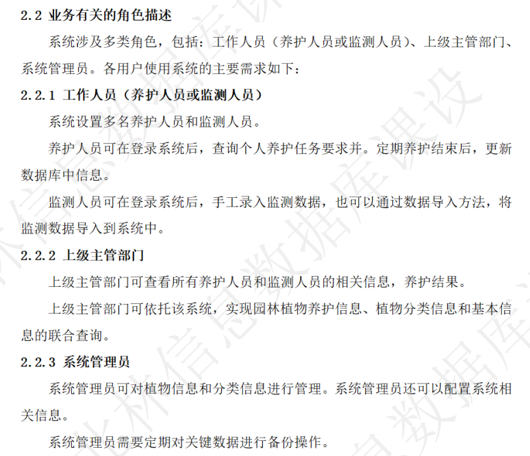

# 2.数字字典

## 实体: 植物

植物编号 (整数，主键)

病名 (字符串)

别名 (字符串)

科名 (字符串)

种名 (字符串)

形态特征 (文本)

栽培技术要点 (文本)

病虫害防治措施 (文本)

应用价值 (文本)

配图编号 (整数)

配图拍摄地点 (字符串)

配图描述 (文本)

配图拍摄人 (字符串)

创建人员 (字符串)

创建时间 (日期)

更新时间 (日期)

## 实体: 分类

科名 (字符串)

属名 (字符串)

种名 (字符串)

别名 (字符串)

分布区域 (字符串)

生长环境 (字符串)

创建人员 (字符串)

创建时间 (日期)

更新时间 (日期)

## 实体: 养护任务

养护任务编号 (整数，主键)

任务名称 (字符串)

执行时间 (日期)

执行地点 (字符串)

执行人员 (字符串)

任务描述 (文本)

养护对象 (整数，外键，指向植物编号)

创建人员 (字符串)

创建时间 (日期)

更新时间 (日期)

## 实体: 病虫害

病虫害名称 (字符串)

防治方法 (文本)

药剂名称 (字符串)

药剂用量 (字符串)

作用期限 (日期)

创建人员 (字符串)

创建时间 (日期)

更新时间 (日期)

## 实体: 监测

监测时间 (日期)

监测人员 (字符串)

监测地点 (字符串)

监测对象 (整数，外键，指向植物编号)

监测指标 (字符串)

监测设备 (字符串)

创建人员 (字符串)

创建时间 (日期)

更新时间 (日期)

# 3.局部ER图

# 4.全局ER图

# 5.逻辑结构设计

# 6.数据库表设计

## 园林植物基本信息管理业务

### 1. 植物表 (plants)

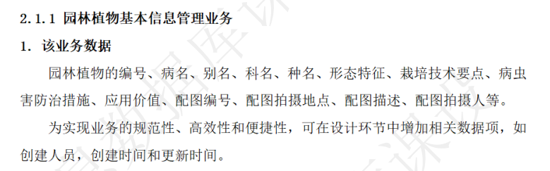

植物编号 (PK) 病名 别名 科名 种名 形态特征 栽培技术要点 应用价值 创建人员 创建时间 更新时间 种ID (FK, 指向 Species)

病虫害防治措施通过查询病虫害防治策略表

配图相关信息通过查询配图表

### 2. 配图表 (pictures)

配图ID (PK) 植物编号 (FK, 指向plants) 拍摄地点 描述 拍摄人 创建人员 创建时间更新时间

### 3. **病虫害防治策略表 (pest\_control\_strategies)**

策略ID (PK)

病虫害编号 (FK, 指向 `pests`)

植物编号（FK，指向植物表）

防治方法

药剂名称

药剂用量

作用期限

其他相关信息（如特定条件下的适用性等）

### 功能实现分析

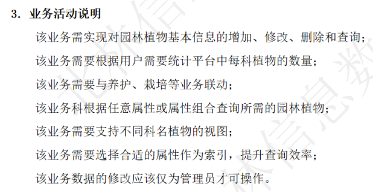

#### 1. 对园林植物基本信息的增加、修改、删除和查询

-   **实现方式**：使用植物表 (Plants) 来实现对基本信息的增加、修改、删除和查询。这些操作通常通过SQL语句来完成，可以在应用程序中实现相应的逻辑。
-   **权限控制**：对数据的修改操作限制为管理员，这通常在应用层面实现，例如通过用户角色和权限管理来控制访问。

#### 2. 统计每科植物的数量

-   **实现方式**：可以通过对科表 (Families)、属表 (Genera)、种表 (Species) 和植物表 (Plants) 进行联合查询来实现。通过SQL的聚合函数（如 `COUNT`）来计算每科植物的数量。

#### 3. 与养护、栽培等业务的联动

-   **实现方式**：通过外键关联实现。例如，养护任务表 (MaintenanceTasks) 通过外键与植物表 (Plants) 相连，可用于实现与养护相关的业务联动。

#### 4. 根据任意属性或属性组合查询园林植物

-   **实现方式**：可以通过在植物表 (Plants) 上编写复杂的SQL查询来实现。多条件查询可以通过组合不同的 `WHERE` 子句实现。

#### 5. 支持不同科名植物的视图

-   **实现方式**：可以通过创建数据库视图或应用程序中的查询逻辑来实现。视图可以基于科表 (Families) 和植物表 (Plants) 的联合查询来创建。

#### 6. 选择合适的属性作为索引，提升查询效率

-   **实现方式**：在数据库中，可以针对经常查询的字段（如植物编号、科名、属名等）创建索引。这将帮助加快查询速度，特别是对于大型数据集。

#### 7. 数据修改权限仅限管理员

-   **实现方式**：这通常是通过在应用层面上实现的，例如，设置用户角色和权限来控制谁可以修改数据。在数据库层面，这涉及到用户访问控制和管理。

## **园林植物分类管理**

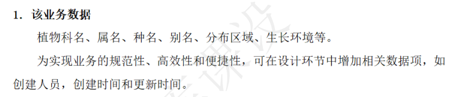

### 1. 科表 (Families)

科ID (PK) 名称 创建人员 创建时间 更新时间

### 2. 属表 (Genera)

属ID (PK） 科ID (FK, 指向 Families) 名称 创建人员 创建时间 更新时间

### 3. 种表 (Species)

种ID (PK) 属ID (FK, 指向 Genera) 名称 分布区域 生长环境 创建人员 创建时间 更新时间

### 4. 分布区域

也可以按照种的方式， 讨论一下

### 建表理由

实现科、属、种、名之间一对多的树状关系，主要有两种方法：使用单表自引用或使用多表分层结构。每种方法都有其适用场景和优缺点。

#### 1. 单表自引用

在这种方法中，可以在一个表中存储所有层次的分类信息，并使用自引用来表示层次关系。

分类表 (categories)

分类ID (PK)名称父分类ID (FK, 指向同一表的分类ID)分类层级（如科、属、种）分布区域生长环境创建人员创建时间

更新时间

优点

-   结构简单，只需要一个表。
-   易于理解和维护。

缺点

-   查询复杂的层级关系可能需要递归查询，这在某些数据库系统中可能效率较低。
-   不适合频繁变动的层级结构。

#### 2. 多表分层结构

在这种方法中，为每个层级（科、属、种）创建独立的表，通过外键关联来构建层级关系。

科表 (families)

科ID (PK) 名称 创建人员 创建时间 更新时间

属表 (genera)

属ID (PK) 科ID (FK, 指向 families) 名称 创建人员 创建时间 更新时间

种表 (species)

种ID (PK) 属ID (FK, 指向 genera) 名称 分布区域 生长环境 创建人员 创建时间 更新时间

优点

-   层级关系清晰，易于扩展和维护。
-   适合大型、复杂的层级结构和频繁变动的分类。

缺点

-   结构较复杂，涉及多个表的联合查询。
-   数据冗余可能较多，特别是在上层分类（如科）的共同属性多的情况下。

选择方法

-   如果分类层级关系相对简单，或者预计不会频繁变动，可以选择单表自引用方法。
-   如果需要处理大量数据，或者层级关系复杂且经常变动，多表分层结构可能更适合。

### 功能分析

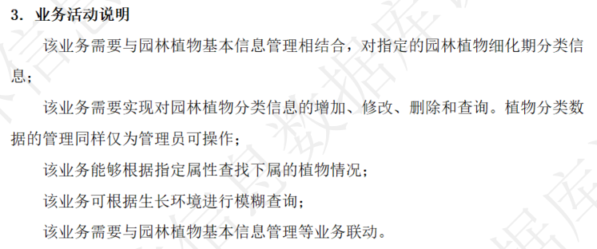

#### 1. 分类信息的管理

#### 增加、修改、删除和查询分类信息

-   通过**科表** (`families`)、**属表** (`genera`) 和 **种表** (`species`) 可以实现分类信息的增加、修改、删除和查询。
-   这些操作通常在数据库层面通过SQL语句执行，可以通过编写相应的后端逻辑或数据库存储过程来实现。
-   管理员特权的实现更多是通过应用程序层面的用户权限管理来控制的。

#### 2. 与植物基本信息的联动

-   植物表可以包含指向种表的外键，从而链接到具体的种。
-   这允许系统根据分类信息查询相关的植物数据，或者根据植物数据查询其分类信息。

#### 3. 查找下属的植物情况

-   可以通过在种表 (`species`) 中查询特定属性来找到对应的植物。
-   例如，可以根据生长环境或其他属性进行查询，然后联结到植物表以找到所有属于该分类的植物。

#### 4. 生长环境的模糊查询

-   在种表 (`species`) 中，可以根据生长环境字段进行模糊查询（如使用SQL的 `LIKE` 语句）。
-   这允许用户根据部分信息搜索相关的分类。

#### 5. 与其他业务的联动

-   由于分类信息与植物信息是通过外键关系紧密相连的，这自然支持了与其他相关业务（如养护任务、监测等）的联动。
-   例如，通过植物ID可以查询到植物的分类信息，进而获取到关于该植物的养护或监测信息。

## **园林植物养护管理**

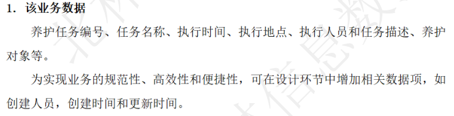

### 1. 养护任务表 (maintenance\_tasks)

养护任务编号 (PK) 任务名称 执行时间 执行地点 执行人员 任务描述 养护对象 (FK, 指向plants) 创建人员 创建时间 更新时间

### 功能实现分析

1\. 对养护信息实现增加、修改、删除和查询

-   数据库设计中已经包含了一个**养护任务表** (MaintenanceTasks)。
-   此表可以用来存储养护任务的详细信息，包括任务编号、名称、执行时间、地点、执行人员和任务描述等。
-   增加、修改、删除和查询养护任务的操作可以通过对此表执行相应的SQL语句来实现。这些操作通常在应用程序层面通过后端逻辑来完成。

2\. 与园林植物基本信息管理的联动

-   养护任务表通过外键“养护对象” (指向植物表的植物编号) 与**植物表** (Plants) 相关联。
-   这种设计允许链接特定的养护任务到具体的植物，实现业务之间的联动。
-   例如，可以查询特定植物的所有养护任务，或者查找需要特定养护措施的植物。

## 园林病虫害防治管理

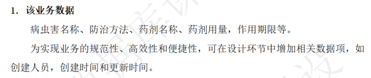

### 1. 病虫害表 (pests)

-   病虫害编号 (PK)
-   名称
-   创建人员
-   创建时间
-   更新时间

### 2. 实际防治记录表 (PestTreatmentRecords)&#x20;

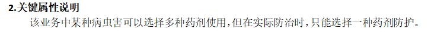

记录ID (PK) 病虫害编号 (FK, 指向 Pests) 选择的策略ID (FK, 指向 PestControlStrategies) 实施日期 实施人员

实施效果 备注

### 功能实现分析

#### 1. 对病虫害信息的增加、修改、删除和查询

-   **实现方式**:
    -   使用**病虫害表** (Pests) 和 **病虫害防治策略表** (PestControlStrategies) 来存储病虫害及其防治方法的信息。
    -   增加、修改、删除和查询病虫害信息的操作可以通过对这些表执行SQL语句来实现。这些操作通常在应用程序层面通过后端逻辑完成。

#### 2. 与园林植物基本信息管理的联动

-   **实现方式**:
    -   **植物表** (Plants) 可以通过外键与病虫害表相关联。例如，可以在植物表中记录某种植物易受哪些病虫害的影响。
    -   这种设计允许系统根据特定的植物数据查询相关的病虫害信息，或者反过来，根据病虫害信息查找可能受影响的植物。

#### 3. 与分类和养护管理的联动

-   **分类管理联动**:
    -   通过**科表** (Families)、**属表** (Genera) 和 **种表** (Species) 的层级结构，可以将病虫害信息与特定分类的植物关联起来。
-   **养护管理联动**:
    -   通过**养护任务表** (MaintenanceTasks)，可以将特定的养护任务与相关的病虫害防治措施关联起来。

## 园林植物检测管理

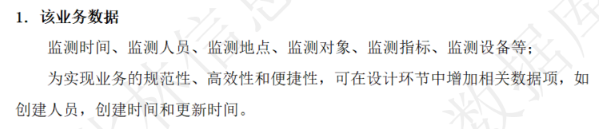

### 1. 监测表 (monitoring)

-   监测ID (PK)
-   监测时间
-   监测人员
-   监测地点
-   监测对象 (FK, 指向plants)
-   监测指标
-   监测设备
-   创建人员
-   创建时间
-   更新时间

### 功能实现分析

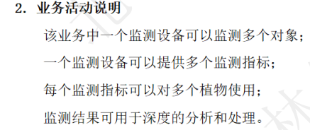

1\. 一个监测设备监测多个对象

-   **实现方式**:
    -   通过**监测表** (Monitoring)，可以记录每次监测活动的详细信息。
    -   在监测表中，可以包含一个字段来指明使用的监测设备，以及监测的植物对象（通过外键指向植物表）。
    -   一个监测设备的ID可以在多个监测记录中重复出现，表示它被用于监测多个对象。

2\. 一个监测设备提供多个监测指标

-   **实现方式**:
    -   在监测表中，可以包含一个或多个字段来记录监测指标。如果监测指标非常多或者非常复杂，可以考虑将监测指标单独存储在一个相关的表中，并通过外键与监测记录关联。

3\. 每个监测指标可以对多个植物使用

-   **实现方式**:
    -   每条监测记录都可以指向不同的植物实体，即使监测指标相同。
    -   可以通过联合查询监测表和植物表来获取关于特定监测指标的所有相关植物信息。

4\. 监测结果的深度分析和处理

-   **实现方式**:
    -   存储在监测表中的数据可以用于深度分析和处理。
    -   数据分析和处理通常在数据库之外进行，例如使用数据分析软件或自定义脚本，但基于数据库中存储的数据。

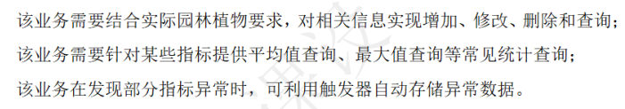

#### 1. 对相关信息的增加、修改、删除和查询

-   **实现方式**：
    -   使用**监测表** (Monitoring) 来存储监测活动的详细信息。
    -   增加、修改、删除和查询操作可以通过对此表执行SQL语句来实现。这些操作通常在应用程序层面通过后端逻辑完成。

#### 2. 提供平均值查询、最大值查询等统计查询

-   **实现方式**：
    -   可以通过SQL的聚合函数（如 `AVG`, `MAX`）对监测表中的数据进行统计查询。
    -   例如，可以针对特定监测指标计算其平均值或最大值，这些查询可以通过编写相应的SQL查询来实现。

#### 3.  利用触发器自动存储异常数据

-   **实现方式**：
    -   在数据库中，可以使用触发器（Trigger）来实现这一功能。
    -   当监测数据被添加或修改时，触发器可以自动检查数据是否满足特定的异常条件。如果满足，触发器可以将这些异常数据记录到一个专门的表中，例如一个名为“异常监测记录”（AbnormalMonitoringRecords）的表。
    -   这种方法可以实时监控数据的异常情况，并及时做出响应。

## 员工管理

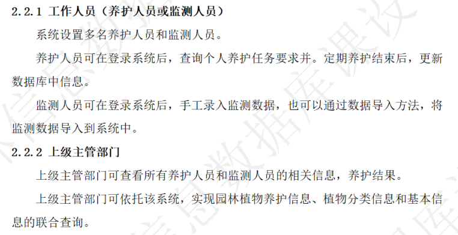

### 1. 员工表 (employees)

-   员工ID (PK)
-   姓名
-   联系方式
-   角色（养护人员、监测人员等）
-   其他相关信息（如地址、部门等）

# 7.完整物理结构设计

**1. 科表 (Families)**

Families(科ID INT PK, 名称 VARCHAR, 创建人员 VARCHAR, 创建时间 DATETIME, 更新时间 DATETIME)

**2. 属表 (Genera)**

Genera(属ID INT PK, 科ID INT FK -> Families.科ID, 名称 VARCHAR, 创建人员 VARCHAR, 创建时间 DATETIME, 更新时间 DATETIME)

**3. 种表 (Species)**

Species(种ID INT PK, 属ID INT FK -> Genera.属ID, 名称 VARCHAR, 分布区域 VARCHAR, 生长环境 VARCHAR, 创建人员 VARCHAR, 创建时间 DATETIME, 更新时间 DATETIME)

**4. 植物表 (Plants)**

Plants(植物编号 INT PK, 种ID INT FK -> Species.种ID, 病名 VARCHAR, 别名 VARCHAR, 形态特征 VARCHAR, 栽培技术要点 VARCHAR, 应用价值 VARCHAR, 创建人员 VARCHAR, 创建时间 DATETIME, 更新时间 DATETIME)

**5. 配图表 (Pictures)**

Pictures(配图ID INT PK, 植物编号 INT FK -> Plants.植物编号, 拍摄地点 VARCHAR, 描述 VARCHAR, 拍摄人 VARCHAR, 创建人员 VARCHAR, 创建时间 DATETIME, 更新时间 DATETIME)

**6. 养护任务表 (MaintenanceTasks)**

MaintenanceTasks(养护任务编号 INT PK, 任务名称 VARCHAR, 执行时间 DATETIME, 执行地点 VARCHAR, 执行人员 VARCHAR, 任务描述 VARCHAR, 养护对象 INT FK -> Plants.植物编号, 创建人员 VARCHAR, 创建时间 DATETIME, 更新时间 DATETIME)

**7. 病虫害表 (Pests)**

Pests(病虫害编号 INT PK, 名称 VARCHAR, 创建人员 VARCHAR, 创建时间 DATETIME, 更新时间 DATETIME)

**8. 病虫害防治策略表 (PestControlStrategies)**

PestControlStrategies(策略ID INT PK, 病虫害编号 INT FK -> Pests.病虫害编号, 防治方法 VARCHAR, 药剂名称 VARCHAR, 药剂用量 VARCHAR, 作用期限 VARCHAR, 其他相关信息 VARCHAR)

**9. 监测表 (Monitoring)**

Monitoring(监测ID INT PK, 监测时间 DATETIME, 监测人员 VARCHAR, 监测地点 VARCHAR, 监测对象 INT FK -> Plants.植物编号, 监测指标 VARCHAR, 监测设备 VARCHAR, 创建人员 VARCHAR, 创建时间 DATETIME, 更新时间 DATETIME)

**10. 异常监测记录表 (AbnormalMonitoringRecords)**（可选）

AbnormalMonitoringRecords(记录ID INT PK, 监测ID INT FK -> Monitoring.监测ID, 异常值 VARCHAR, 记录时间 DATETIME, 备注 VARCHAR)

**11. 员工表 (Employees)**

Employees(员工ID INT PK, 姓名 VARCHAR, 联系方式 VARCHAR, 角色 VARCHAR, 其他相关信息 VARCHAR)
